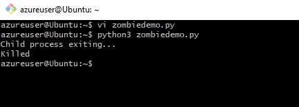

### Explanation:

created a zombie process using a simple Python script by forking a child and allowing the child to exit immediately while the parent slept for a long time.

Opened two sessions into my Azure Linux VM:

### Session 1: ran the python script

### Session 2: ran commands to identify and kill zombie  

### commands used to identfy zombie

 ps aux | grep " Z"

 ps -eo pid,ppid,stat | grep Z

  kill -9 ppid - to kill the parent process

