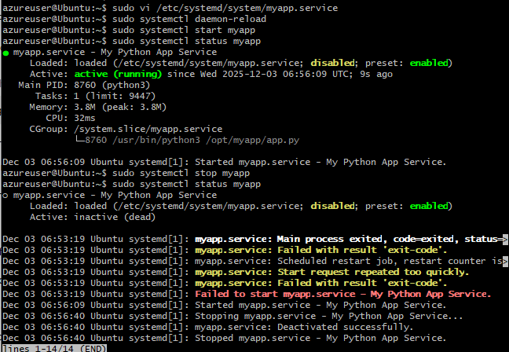

1.	User Management Exercise:

o	Create 3 users (dev1, dev2, admin1)
o	Create "developers" group
o	Add dev users to group
o	Create shared directory with proper permissions

### Setting up shared project directory
        useradd dev1

        useradd dev2

        useradd admin1

        groupadd developers
        ----------------------------
        usermod -aG developers dev1

        usermod -aG developers dev2
        -------------------------
        mkdir /shared-project

        chown :developers /shared-project

        chmod 2774 /shared-project
        -------------------------
        ### imp cmds

        getent group developers

        ls -ld /shared 
        (view owner permissions of created dr)

### 2 = SGID bit (new files inherit group)
### 774 = rwxrwxr--

2.	Service Management Exercise:
o	Install nginx
o	Create custom service for a Python/Node app
o	Configure to start on boot
o	Practice stop/start/restart
o	View logs

