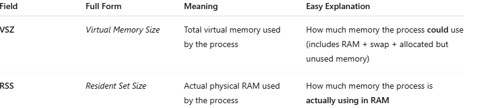
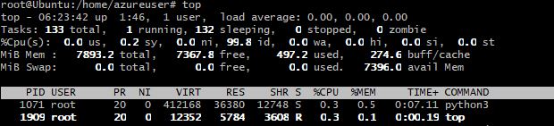
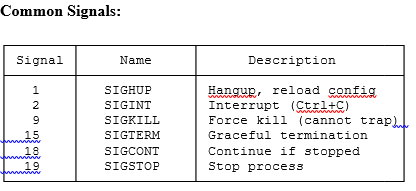
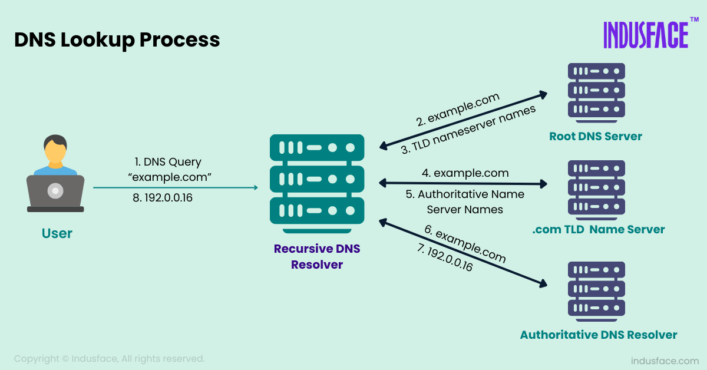
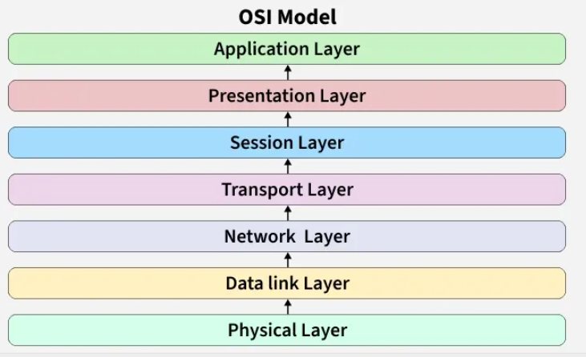
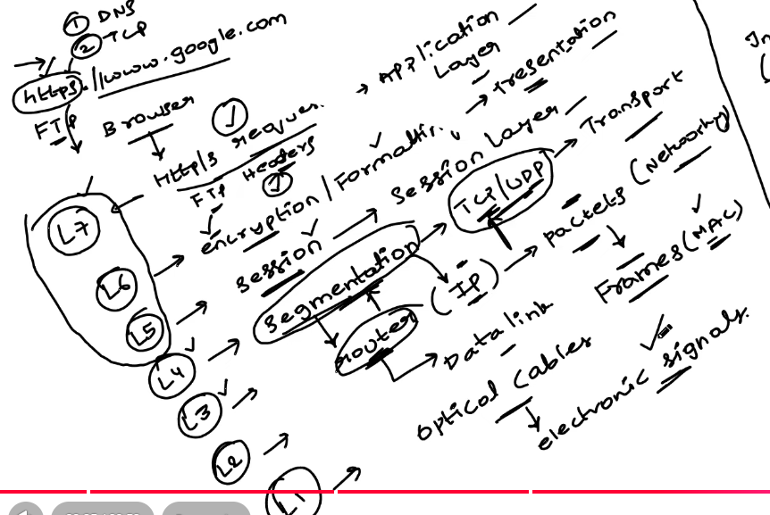

# System Administration

### User & Group Management

Key files involved in user management:
- `/etc/passwd` – Stores user account details.
- `/etc/shadow` – Stores encrypted user passwords.
- `/etc/group` – Stores group information.
- `/etc/gshadow` – Stores secure group details.

### `useradd` Command 
```bash
useradd username
```
To create a user with a home directory:
```bash
useradd -m username
```
To specify a shell:
```bash
useradd -s /bin/bash username
```

## Working with Groups
### Creating Groups
```bash
groupadd groupname
```## Working with Groups
### Creating Groups
```bash
groupadd groupname
```


# 

### How a Linux Package Manager Works

1. User runs apt install or dnf install

     tells pkg mgr -"Search for this package and install it."

2. Pkg mgr checks config fles 

        /etc/apt/sources.list

        /etc/apt/sources.list.d/

    identfy :

    Which servers to connect to

3. Connects to online repository servers and fetch:

        It fetches:

        package lists

        metadata

        dependency information

4.  Compare Versions

        version installed in local db - /var/lib/dpkg/ with

        latest version available in the repository

If newer versions exist, it marks them for upgrade.

5. Dependency Resolution (install, update,remove)

6. Downloads the actual .deb/.rpm packages

7. Installs the Package , extract files 

            Path	        Purpose
            /usr/bin    -	executables
            /usr/lib    -   libraries
            /etc        -   config files
            /usr/share  -   manuals, documentation  

9. Updates local package database 


# 
### Users & Permissons

getent group developers - list users in group

        ### User Management:
        useradd, usermod, userdel, passwd,      groupadd, groupdel
        chmod, chown, chgrp, sudo, visudo

 ### Process Management Commands  

 ps aux

        a: all users
        u: user-oriented format
        x: include processes without controlling terminal


 

#

ps -ef 


       
### TTY
        Terminal Type

        Terminal associated with process 
        (pts/x, - Pseudo terminal session (SSH) 
        
        tty1, 
        
        ttyS0, -First serial port (COM1)    
        
        ?)- No terminal attached

### top



Kill signals



       
       systemctl Commands
        
        A) Service Control
        
        ### List all open files
        sudo lsof

        ### Start service
        sudo systemctl start nginx

        ### Stop service
        sudo systemctl stop nginx

        ### Restart service
        sudo systemctl restart nginx

        B) Service Status

        ### Check service status
        systemctl status nginx

        Shows: Active state, PID, memory, recent logs
        systemctl is-active nginx

        C) Enable/Disable Services
        bash
        ### Enable at boot
        sudo systemctl enable nginx

       ### Enable and start immediately
        sudo systemctl enable --now nginx

        # Prevent service from starting (mask)
        sudo systemctl mask nginx
        sudo systemctl unmask nginx

        D) # List failed services
            systemctl --failed
            # Show service dependencies
            systemctl list-dependencies nginx


#
### Checking Distribution


        ### Method 1
        cat /etc/os-release

        ### Method 2
        lsb_release -a

# Networking

Connecting devices so they can exchange data.

Internet- collecton of computer networks

Protocols : rules setup for transfer of diff types of data 

### Core Concepts
#### 1. IP Address
- **Purpose:** Unique address for each device/server
- **Analogy:** Home address or building address
- **Example:** `192.168.1.100`
- **Types:** IPv4, IPv6

#### 2. Port Number
- **Purpose:** Identifies specific service/application on a device
- **Analogy:** Apartment/room number in a building
- **Range:** 0-65535
- **Examples:**
  - SSH: 22
  - HTTP: 80
  - HTTPS: 443
  - MySQL: 3306

#### 3. MAC Address
- **Purpose:** Hardware-level unique identifier
- **Characteristics:** Assigned by manufacturer, permanent
- **Format:** `00:1B:44:11:3A:B7`

#### 4. Router
- **Purpose:** Forwards packets between networks
- **Function:** Finds optimal path to destination IP
- **Analogy:** Post office routing mail to correct location

#### 5. Packets
- **Definition:** Small chunks of data transmitted over network
- **Analogy:** Envelopes containing portions of a message

#### 6. Protocols
- **Definition:** Rules/standards for network communication
- **Examples:** TCP, UDP, HTTP, HTTPS, SSH
- **Purpose:** Ensure consistent communication between devices




      ## Mobile phonebook analogy - Domain Name system

       domain names(contacts)

        Ip addresess (numbers)

      http -> DNS direcotry/ db

    
    
    
    
    Steps:
    
    local cache

    local DNS server (Internet servce provider)

    Root server

    TLD - top level domans

OS LAYERS


Newtork Layer - data transfer from one netwrok to another 

Transport layer - data transfer from netwokr to applicatons ( send msg to watsapp,chrome,insta ?)

Analogy: sending courier to frnd on diff location

you --(transport layer)->courier in your loc---(network layer)--->courier in dff loc-(transport layer)->your frnd

tansport layer- TCP /UDP



