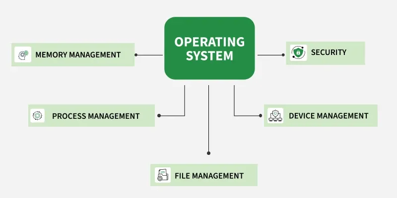
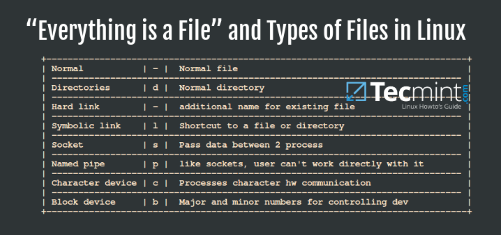
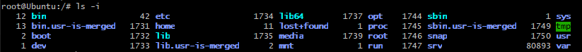
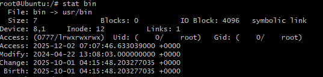
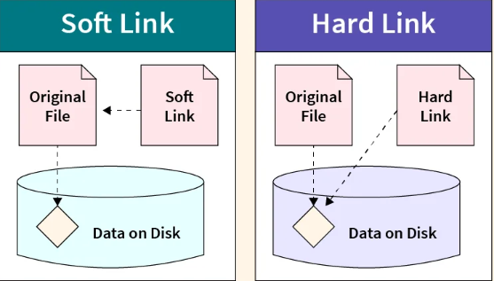
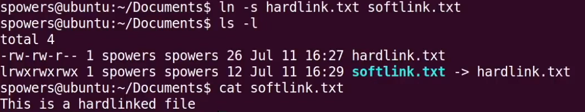

# 1. Operating System
### what?
main software that helps you use your computer.
Without it, your device is just a box of hardware that can’t do anything.
### why OS?
OS is the middleman between you and the computer hardware.
It helps apps run, manages files, memory, storage, keyboard, screen — everything.

**Simple Analogy :**
Why Chef (OS) is needed?

You can’t directly go into the kitchen (hardware) and cook a dish (run apps).
The chef (OS) understands your order (open Chrome, open Word, start a game),
and uses the kitchen tools (CPU, memory, disk) to prepare it.
Without OS = No chef → restaurant cannot function.

### Key Responsibilities


Manages Resources, Users, FileSystem, Memory, Processes

### Multiple OS - why Linux (Mac/Windows/Linux Comparision)
**Windows**(GUI-focused, less secure), **Linux**(CLI-focused, secure, file-system oriented), **Mac** (hybrid)

**why Linux?** -- **Security**

Linux is more secure because it follows a strict “**deny first**, allow only minimal access” model — this is called **least privilege.**

# 2. Linux Architecture (Layered View)
```plaintext
+----------------------------------------------------+
| User Applications (Vim, Docker, Apache, etc.)     |
+----------------------------------------------------+
| Shell (bash, zsh, sh - Command Interpreters)      |  <-- Part of the OS
+----------------------------------------------------+
| System Libraries (glibc, systemd, etc.)           |  <-- Part of the OS
+----------------------------------------------------+
| System Utilities (ls, grep, systemctl, etc.)      |  <-- Part of the OS
+----------------------------------------------------+
| Linux Kernel (Process, Memory, FS, Network)       |  <-- Core of the OS
+----------------------------------------------------+
| Hardware (CPU, RAM, Disk, Network, Peripherals)   |
+----------------------------------------------------+
```
### Boot Process
| Step                                | Purpose             | Simple Explanation                                                  |
| ----------------------------------- | ------------------- | ------------------------------------------------------------------- |
| **1. BIOS / UEFI**                  | Hardware Check      | BIOS checks if RAM, CPU, keyboard, etc. are working (POST test).    |
| **2. Bootloader (GRUB)**            | Loads OS            | Bootloader chooses which OS to start and loads the Linux kernel.    |
| **3. Kernel Initialization**        | Controls System     | Linux kernel loads into RAM and takes control of hardware & system. |
| **4. Init System (systemd / init)** | Starts Services     | Init starts basic processes (network, logging, etc.).               |
| **5. System Services**              | Background Programs | Starts services like network manager, display manager, ssh, etc.    |
| **6. Login Prompt**                 | User Login          | Shows login screen (Terminal or GUI) for the user to log in.        |


### Linux Kernel: Key Responsibilities
• Process Management - Process Lifecycle ()      
• Memory Management       
• File System Management                 
• Device Drivers                         
• Network Stack                             

### File System in Linux


•Everything is a file in linux.

•Linux uses a unified file abstraction model.
•Devices under /dev, process data under /proc, kernels & hardware attributes under /sys, pipes, sockets, directories — all behave like files.
•The same system calls — open, read, write, close — can be used universally.



### Important Directories
sudo su - switch to root

cd / - go to home dir

ls /etc - ls on each directory 


/etc - Configuration files (os-release - os , version | passwd -users details | hosts - ip addresses)

similar to C:/ drive in windows

/var - Variable data (logs, cache, frequently changing files)

/opt - Optional third-party dependencies (instal custom tools - to access for everyone)

/home - User directories

/sbin - Essential system binaries (used by sys admins - useradd, rmuser, etc)

/bin  - user binaries (non admin command - date, sed, sh etc)

/proc - Process and kernel information

/dev - Device files

/mnt - mount new volumes /disks

### what happens when you run a command:
•like ls or useradd etc

•useradd user1 - it wil go and check in sbin folder for useradd cmd frm there cmd gets executed

### inode Concept
 ls -i returns flenames, inodes associated in a table
 
 

• Definition: Metadata structure storing file information (permissions, size, owner, timestamps, block pointers)

disk has plenty of space left for data but you cannot create more files and it says disk full or you get write error - it is bcause your inodes are exhausted.

df -h

df-i (check inode usage)

Hardlink soft lnk files

### creating hardlink between files - both files point same loc on hardisk. Any one is changed both files are effected. If one is deleted other still remains and keeps ponting to data on Hard disk 


### soft link file creation



### Linux Commands
Navigation: ls, cd, pwd, tree
File Operations: touch, mkdir, cat, cp, mv, rm
Search/Filter: grep, find, sed, cut, sort, uniq
Permissions: chmod, chown, chgrp
System Info: df, du, who, uname

### search / Filter commands examples

grep -i "error" /var/log/syslog  

find / -name "abc.txt"

sed – Edit streams (search/replace)


### sort
sort names.txt

sort -n nums.txt      -- numeric sort

sort -r names.txt    -- reverse

### uniq
sort names.txt | uniq

sort names.txt | uniq -c      # count occurrences

sort names.txt | uniq -d      # show duplicates only

### Pipe (|): Pass output of one command as input to another
Redirection:


Wildcards: * (any characters), ? (single character), [] (character class)

Anchors: ^ (start of line), $ (end of line)

### Wildcards(*, ?, [])

chmod 644 *.sh (modify permis of files with .sh extension)

rm data[AB].csv (remove fles with filename havng character set as A or B )

ls file?.txt (lists fle with 1 char after file in filename)

### Anchors: ^ (start of line), $ (end of line)

1. Lines that start with “root” (^)

    grep "^root" users.txt
2. Lines ending with /bin/bash ($)

    grep "/bin/bash$" users.txt

### PRACTICE REGEX USING sed
